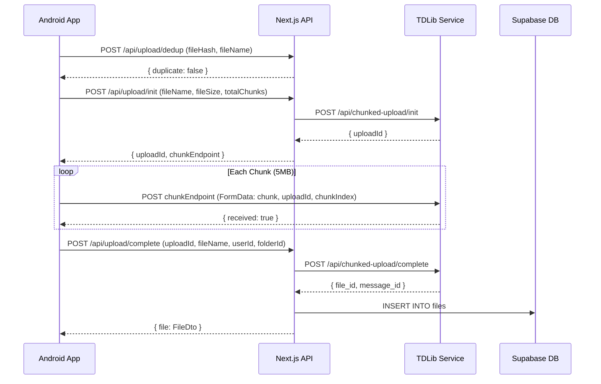
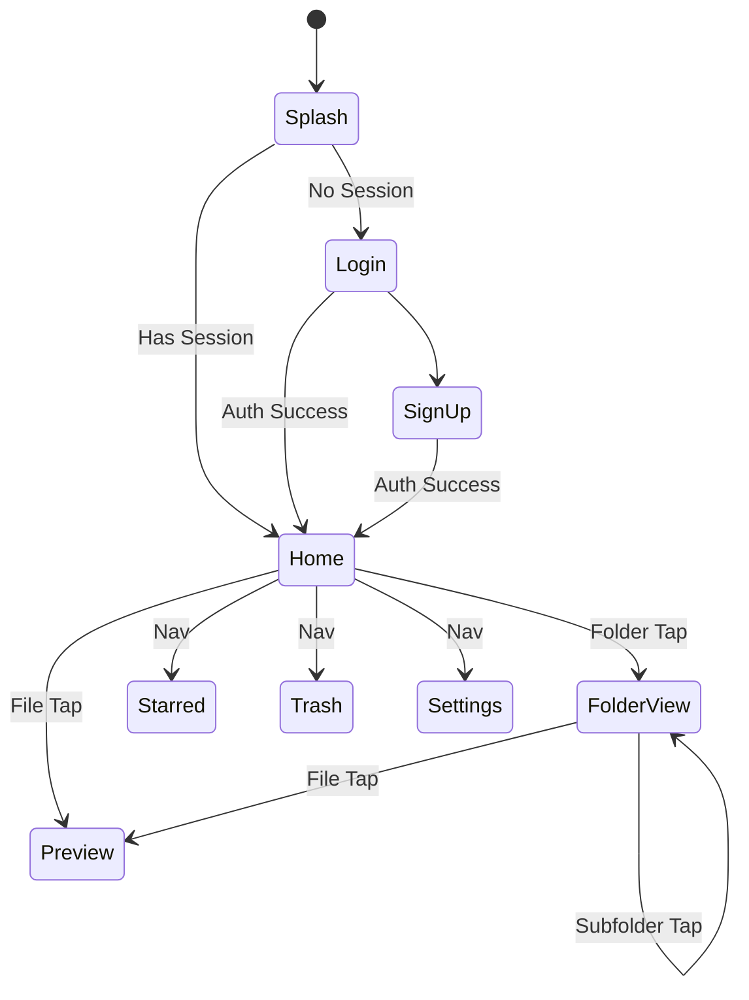
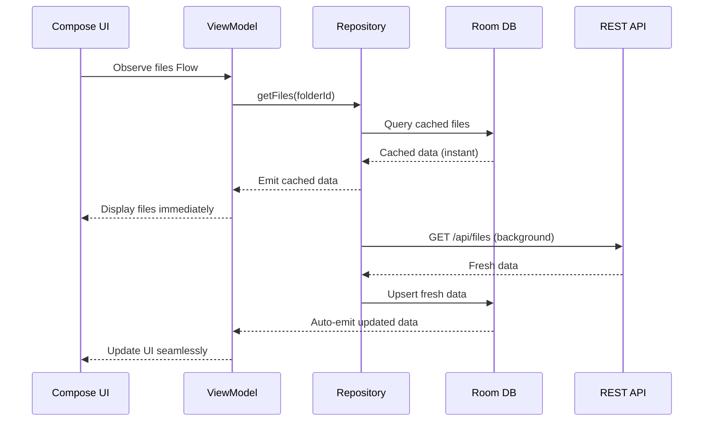

I have created the following plan after thorough exploration and analysis of the codebase. Follow the below plan verbatim. Trust the files and references. Do not re-verify what's written in the plan. Explore only when absolutely necessary. First implement all the proposed file changes and then I'll review all the changes together at the end.

# NDrive Cloud Drive — Android Kotlin App Implementation Plan

## Observations

Your backend (`frontain/`) is a Next.js app proxying to a TDLib service for Telegram-based file storage. It uses **Supabase Auth** (JWT, email/password + Google OAuth) with 4 core tables: `users`, `files`, `folders`, `shared_links`. The API follows a chunked upload pattern (`init` → `chunk` → `complete/finalize`) and redirect-based downloads via signed URLs. The existing `file:KotlinApp/Main.kt` is empty — this is a greenfield Android project.

## Approach

Build a **MVVM + Clean Architecture** Android app targeting the existing REST API at `frontain/`. Use **Supabase Kotlin SDK** for auth (avoids reimplementing JWT management), **Retrofit + OkHttp** for API calls, **Room** for offline cache, **WorkManager** for background transfers, and **Jetpack Compose Material 3** for UI. The project structure follows the standard 3-layer clean architecture (data → domain → presentation) with Hilt for DI.

---

## Step 1 — Project Structure

Create the following package/directory structure inside `file:KotlinApp/`:

```
KotlinApp/
├── app/
│   ├── build.gradle.kts
│   └── src/main/
│       ├── AndroidManifest.xml
│       ├── java/com/ndrive/cloudvault/
│       │   ├── NDriveApp.kt                          # Application class (Hilt)
│       │   ├── MainActivity.kt                        # Single Activity host
│       │   ├── di/
│       │   │   ├── AppModule.kt                       # Hilt: Retrofit, OkHttp, Room
│       │   │   ├── RepositoryModule.kt                # Hilt: Repository bindings
│       │   │   └── AuthModule.kt                      # Hilt: Supabase client
│       │   ├── data/
│       │   │   ├── remote/
│       │   │   │   ├── api/
│       │   │   │   │   ├── FilesApi.kt                # Retrofit interface — /api/files
│       │   │   │   │   ├── FoldersApi.kt              # Retrofit interface — /api/folders
│       │   │   │   │   ├── UploadApi.kt               # Retrofit interface — /api/upload/*
│       │   │   │   │   ├── DownloadApi.kt             # Retrofit interface — /api/download
│       │   │   │   │   └── ShareApi.kt                # Retrofit interface — /api/share
│       │   │   │   ├── dto/
│       │   │   │   │   ├── FileDto.kt
│       │   │   │   │   ├── FolderDto.kt
│       │   │   │   │   ├── UserDto.kt
│       │   │   │   │   ├── SharedLinkDto.kt
│       │   │   │   │   ├── UploadInitResponse.kt
│       │   │   │   │   └── ApiResponse.kt
│       │   │   │   └── interceptor/
│       │   │   │       └── AuthInterceptor.kt         # Injects Supabase JWT
│       │   │   ├── local/
│       │   │   │   ├── NDriveDatabase.kt              # Room database
│       │   │   │   ├── dao/
│       │   │   │   │   ├── FileDao.kt
│       │   │   │   │   ├── FolderDao.kt
│       │   │   │   │   └── UserDao.kt
│       │   │   │   └── entity/
│       │   │   │       ├── FileEntity.kt
│       │   │   │       ├── FolderEntity.kt
│       │   │   │       └── UserEntity.kt
│       │   │   └── repository/
│       │   │       ├── FileRepositoryImpl.kt
│       │   │       ├── FolderRepositoryImpl.kt
│       │   │       ├── AuthRepositoryImpl.kt
│       │   │       └── UploadRepositoryImpl.kt
│       │   ├── domain/
│       │   │   ├── model/
│       │   │   │   ├── DriveFile.kt                   # Domain model
│       │   │   │   ├── DriveFolder.kt
│       │   │   │   ├── User.kt
│       │   │   │   ├── SharedLink.kt
│       │   │   │   ├── FileCategory.kt                # enum: image, video, audio, etc.
│       │   │   │   └── UploadState.kt                 # sealed class
│       │   │   ├── repository/
│       │   │   │   ├── FileRepository.kt              # Interface
│       │   │   │   ├── FolderRepository.kt
│       │   │   │   ├── AuthRepository.kt
│       │   │   │   └── UploadRepository.kt
│       │   │   └── usecase/
│       │   │       ├── GetFilesUseCase.kt
│       │   │       ├── GetFoldersUseCase.kt
│       │   │       ├── UploadFileUseCase.kt
│       │   │       ├── DownloadFileUseCase.kt
│       │   │       ├── ToggleStarUseCase.kt
│       │   │       ├── TrashFileUseCase.kt
│       │   │       ├── CreateFolderUseCase.kt
│       │   │       └── ShareFileUseCase.kt
│       │   ├── presentation/
│       │   │   ├── navigation/
│       │   │   │   └── NavGraph.kt                    # Navigation Compose
│       │   │   ├── theme/
│       │   │   │   ├── Theme.kt
│       │   │   │   ├── Color.kt
│       │   │   │   ├── Type.kt
│       │   │   │   └── Shape.kt
│       │   │   ├── common/
│       │   │   │   ├── FileIcon.kt                    # File type icon composable
│       │   │   │   ├── LoadingState.kt
│       │   │   │   └── ErrorState.kt
│       │   │   ├── auth/
│       │   │   │   ├── LoginScreen.kt
│       │   │   │   ├── SignupScreen.kt
│       │   │   │   └── AuthViewModel.kt
│       │   │   ├── home/
│       │   │   │   ├── HomeScreen.kt
│       │   │   │   ├── HomeViewModel.kt
│       │   │   │   ├── components/
│       │   │   │   │   ├── FileCard.kt
│       │   │   │   │   ├── FileRow.kt
│       │   │   │   │   ├── FolderCard.kt
│       │   │   │   │   ├── SearchBar.kt
│       │   │   │   │   ├── BottomNav.kt
│       │   │   │   │   └── FloatingUploadButton.kt
│       │   │   ├── preview/
│       │   │   │   ├── PreviewScreen.kt
│       │   │   │   └── PreviewViewModel.kt
│       │   │   └── upload/
│       │   │       ├── UploadProgressOverlay.kt
│       │   │       └── UploadViewModel.kt
│       │   └── worker/
│       │       ├── UploadWorker.kt                    # WorkManager upload
│       │       └── DownloadWorker.kt                  # WorkManager download
│       └── res/
│           ├── values/
│           │   ├── strings.xml
│           │   ├── colors.xml
│           │   └── themes.xml
│           └── drawable/                              # App icons
├── build.gradle.kts                                   # Project-level
├── settings.gradle.kts
└── gradle.properties
```

---

## Step 2 — Dependencies (`build.gradle.kts`)

Create the project-level and app-level Gradle files with the following dependencies:

| Category | Library | Purpose |
|---|---|---|
| **Compose** | `androidx.compose.material3`, `androidx.compose.ui`, `androidx.activity:activity-compose` | Material 3 UI framework |
| **Navigation** | `androidx.navigation:navigation-compose` | Screen navigation |
| **Lifecycle** | `androidx.lifecycle:lifecycle-viewmodel-compose`, `lifecycle-runtime-compose` | ViewModel + Compose integration |
| **DI** | `com.google.dagger:hilt-android`, `hilt-navigation-compose` | Dependency injection |
| **Network** | `com.squareup.retrofit2:retrofit`, `converter-gson`, `com.squareup.okhttp3:okhttp`, `logging-interceptor` | REST API communication |
| **Auth** | `io.github.jan-tennert.supabase:gotrue-kt`, `supabase-compose-auth` | Supabase authentication |
| **Database** | `androidx.room:room-runtime`, `room-ktx`, `room-compiler` (ksp) | Offline SQLite cache |
| **Background** | `androidx.work:work-runtime-ktx` | Background uploads/downloads |
| **Image** | `io.coil-kt:coil-compose` | Async image loading (thumbnails) |
| **Serialization** | `org.jetbrains.kotlinx:kotlinx-serialization-json` | JSON parsing |
| **Coroutines** | `org.jetbrains.kotlinx:kotlinx-coroutines-android` | Async operations |
| **DataStore** | `androidx.datastore:datastore-preferences` | Token/session persistence |

Set `minSdk = 26`, `targetSdk = 35`, `compileSdk = 35`.

---

## Step 3 — Data Layer: DTOs & Room Entities

### 3.1 — Remote DTOs

Create data classes in `data/remote/dto/` that mirror the backend response shapes from `file:frontain/src/types/database.types.ts`:

- **`FileDto`** — mirrors the `files` table Row: `id`, `user_id`, `guest_session_id`, `folder_id`, `name`, `original_name`, `mime_type`, `size_bytes`, `telegram_file_id`, `telegram_message_id`, `tdlib_file_id`, `thumbnail_url`, `file_hash`, `storage_type`, `telegram_chat_id`, `is_starred`, `is_trashed`, `trashed_at`, `created_at`, `updated_at`
- **`FolderDto`** — mirrors the `folders` table Row: `id`, `user_id`, `guest_session_id`, `parent_id`, `name`, `color`, `is_trashed`, `trashed_at`, `created_at`, `updated_at`
- **`UserDto`** — mirrors the `users` table Row
- **`UploadInitResponse`** — `uploadId: String`, `chunkEndpoint: String` (from `file:frontain/src/app/api/upload/init/route.ts`)
- **`ApiResponse<T>`** — generic wrapper with `error: String?` field

### 3.2 — Room Entities

Create Room entity classes in `data/local/entity/` with the same fields as DTOs but annotated with `@Entity`, `@PrimaryKey`, `@ColumnInfo`. Add a `lastSyncedAt: Long` field for cache invalidation.

### 3.3 — Room DAOs

In `data/local/dao/`:
- **`FileDao`** — `@Query` for: files by folder_id, starred files, trashed files, search by name. `@Insert(onConflict = REPLACE)`, `@Update`, `@Delete`.
- **`FolderDao`** — `@Query` for: folders by parent_id, all non-trashed folders. Same CRUD operations.
- **`UserDao`** — Get/upsert current user profile.

### 3.4 — Room Database

`NDriveDatabase` with entities `[FileEntity, FolderEntity, UserEntity]`, version 1, export schema = true.

---

## Step 4 — Data Layer: Retrofit API Interfaces

Create Retrofit interfaces in `data/remote/api/` matching the backend endpoints from `file:frontain/src/app/api/`:

### `FilesApi`
| Method | Path | Params | Response |
|---|---|---|---|
| `GET` | `/api/files` | `@Query user_id, folder_id, starred, trashed` | `{ files: FileDto[] }` |
| `PATCH` | `/api/files` | `@Body { id, ...updates }` | `{ file: FileDto }` |
| `POST` | `/api/files` | `@Body { action: "copy", fileId }` | `{ file: FileDto }` |

### `FoldersApi`
| Method | Path | Params | Response |
|---|---|---|---|
| `GET` | `/api/folders` | `@Query user_id` | `{ folders: FolderDto[] }` |
| `POST` | `/api/folders` | `@Body { name, color, parent_id, user_id }` | `{ folder: FolderDto }` |
| `PATCH` | `/api/folders` | `@Body { id, ...updates }` | `{ folder: FolderDto }` |
| `DELETE` | `/api/folders` | `@Query id` | `{ success: Boolean }` |

### `UploadApi`
| Method | Path | Body | Response |
|---|---|---|---|
| `POST` | `/api/upload/init` | JSON: `fileName, fileSize, mimeType, userId, totalChunks` | `UploadInitResponse` |
| `POST` | chunk endpoint (returned by init) | `@Multipart: chunk, uploadId, chunkIndex` | `{ received: true }` |
| `POST` | `/api/upload/complete` | JSON: `uploadId, fileName, fileSize, mimeType, userId, folderId, fileHash` | `{ file: FileDto }` |
| `POST` | `/api/upload/dedup` | JSON: `fileName, fileHash, userId, folderId` | `{ duplicate, reason, file }` |

### `DownloadApi`
- `GET /api/download/{id}` → Returns **302 redirect** to signed URL. Use `@Streaming` and handle redirect with OkHttp.

### `ShareApi`
- `POST /api/share` → `{ fileId, userId }` → `{ token, linkId }`

### Auth Interceptor
Create `AuthInterceptor` in `data/remote/interceptor/` that:
1. Reads the current Supabase access token from `gotrue-kt`
2. Adds `Authorization: Bearer <token>` header to every request
3. Adds Supabase cookies required by the server-side middleware at `file:frontain/src/middleware.ts`

---

## Step 5 — Domain Layer

### 5.1 — Domain Models

In `domain/model/`:
- **`DriveFile`** — clean domain model mapped from `FileDto`/`FileEntity`. Include computed property `category: FileCategory` using the same logic from `getFileCategory()` in `file:frontain/src/types/file.types.ts`
- **`DriveFolder`** — mapped from `FolderDto`/`FolderEntity`
- **`FileCategory`** — enum: `IMAGE, VIDEO, AUDIO, DOCUMENT, PDF, ARCHIVE, OTHER`
- **`UploadState`** — sealed class: `Idle`, `Preparing`, `Uploading(progress, bytesLoaded, bytesTotal, speedBps)`, `Finalizing`, `Success(file)`, `Error(message)`, `Duplicate`

### 5.2 — Repository Interfaces

In `domain/repository/`:
- **`FileRepository`** — `getFiles(folderId?, starred?, trashed?): Flow<List<DriveFile>>`, `updateFile(id, updates)`, `deleteFile(id)`
- **`FolderRepository`** — `getFolders(parentId?): Flow<List<DriveFolder>>`, `createFolder(name, parentId?, color?)`, `updateFolder(id, updates)`, `deleteFolder(id)`
- **`AuthRepository`** — `signIn(email, password)`, `signUp(email, password)`, `signInWithGoogle()`, `signOut()`, `getCurrentUser(): Flow<User?>`, `getAccessToken(): String?`
- **`UploadRepository`** — `uploadFile(uri, folderId?): Flow<UploadState>`, `checkDedup(fileName, fileHash, folderId?)`

### 5.3 — Use Cases

Each use case in `domain/usecase/` is a single-responsibility class. For example, `GetFilesUseCase` invokes `FileRepository.getFiles()` applying cache-first strategy (return cached → fetch remote → update cache → emit remote).

---

## Step 6 — Data Layer: Repository Implementations

### 6.1 — `FileRepositoryImpl`

Implements the **cache-first pattern** mirroring `file:frontain/src/store/files-store.ts`:
1. Query `FileDao` for cached data → emit immediately
2. Fetch from `FilesApi.getFiles(userId)` in background
3. Upsert results into `FileDao`
4. Emit updated data from Room (Room's `Flow` handles this automatically)

### 6.2 — `AuthRepositoryImpl`

Uses the **Supabase Kotlin SDK** (`gotrue-kt`):
- `signIn()` → `supabase.gotrue.loginWith(Email) { ... }`
- `signUp()` → `supabase.gotrue.signUpWith(Email) { ... }`
- `signInWithGoogle()` → `supabase.gotrue.loginWith(Google) { ... }`
- Session persistence handled by `gotrue-kt`'s `SessionManager`
- Expose `currentSession` as a `StateFlow<UserSession?>`

### 6.3 — `UploadRepositoryImpl`

Implements the 3-phase chunked upload matching `file:frontain/src/app/api/upload/init/route.ts`:



Chunk size: **5 MB** (matching frontend behavior). Use `OkHttp` `RequestBody` with `ProgressRequestBody` wrapper to report per-chunk progress.

---

## Step 7 — DI Module Setup

### `AppModule` (Hilt `@Module`)
- Provide `OkHttpClient` with `AuthInterceptor`, logging interceptor, 60s timeouts
- Provide `Retrofit` instance pointing to `BASE_URL` (the frontain deployment URL)
- Provide all API interfaces via `Retrofit.create()`
- Provide `NDriveDatabase` via `Room.databaseBuilder()`
- Provide all DAOs from the database instance

### `AuthModule`
- Provide `SupabaseClient` configured with project URL + anon key (same values as `NEXT_PUBLIC_SUPABASE_URL` / `NEXT_PUBLIC_SUPABASE_ANON_KEY` from the frontend)

### `RepositoryModule`
- Bind `FileRepositoryImpl` → `FileRepository`
- Bind `FolderRepositoryImpl` → `FolderRepository`
- Bind `AuthRepositoryImpl` → `AuthRepository`
- Bind `UploadRepositoryImpl` → `UploadRepository`

---

## Step 8 — Presentation Layer: Theme & Navigation

### 8.1 — Material 3 Theme

In `presentation/theme/`:
- Define a color scheme inspired by the web app — primary blue tones with neutral surface colors (referencing the Tailwind-based design in `file:frontain/src/app/globals.css`)
- Set up `NDriveTheme` composable wrapping `MaterialTheme` with dynamic color support on Android 12+
- Typography using `Inter` or system default

### 8.2 — Navigation Graph

In `presentation/navigation/NavGraph.kt`:



Use `NavHost` with sealed class `Screen` routes: `Login`, `SignUp`, `Home`, `Folder(id)`, `Preview(fileId)`, `Starred`, `Trash`, `Settings`.

---

## Step 9 — Presentation: Auth Screens

### `LoginScreen`
- Material 3 `TextField` for email/password
- "Sign In" button calling `AuthViewModel.signIn()`
- Google Sign-In button (matching `file:frontain/src/components/auth/google-auth-button.tsx`)
- "Forgot Password" link
- Navigate to `SignupScreen` link

### `SignupScreen`
- Same layout with additional display name field
- Calls `AuthViewModel.signUp()`

### `AuthViewModel`
- Exposes `authState: StateFlow<AuthUiState>` (sealed: `Idle`, `Loading`, `Success(user)`, `Error(message)`)
- Delegates to `AuthRepository`
- On success, navigate to Home

---

## Step 10 — Presentation: Home Screen

### `HomeScreen` — Main Drive View

The home screen mirrors `file:frontain/src/app/drive/page.tsx` with:

1. **Top App Bar** — App title + `SearchBar` composable (matching `file:frontain/src/components/top-bar/search-bar.tsx`)
2. **Folder Grid Section** — Horizontal scrollable `LazyRow` of `FolderCard` items (matching `file:frontain/src/components/file-grid/folder-grid.tsx`)
3. **File Grid/List Toggle** — ViewMode toggle (grid ↔ list), same as `ViewMode` in the web app
4. **File Grid** — `LazyVerticalGrid` of `FileCard` composables showing thumbnail, name, size, date (matching `file:frontain/src/components/file-grid/file-card.tsx`)
5. **File List** — `LazyColumn` of `FileRow` composables with icon, name, size, date columns (matching `file:frontain/src/components/file-list/file-row.tsx`)
6. **FAB** — Floating action button for upload (matching `file:frontain/src/components/upload/mobile-upload-fab.tsx`)
7. **Bottom Navigation** — Home, Starred, Shared, Trash, Settings

### `HomeViewModel`
- `uiState: StateFlow<HomeUiState>` holding `files`, `folders`, `viewMode`, `isLoading`, `searchQuery`
- Observes `FileRepository.getFiles()` and `FolderRepository.getFolders()` as Flows
- Search filtering done locally on the combined list
- Pull-to-refresh triggers remote re-fetch

### Component Details

**`FileCard`** composable:
- Thumbnail (Coil `AsyncImage`) or file type icon fallback
- File name (max 2 lines, ellipsize)
- File size formatted using same logic as `formatFileSize()` from `file:frontain/src/types/file.types.ts`
- Star indicator
- Context menu (long press): Rename, Star/Unstar, Move, Trash, Share, Download

**`FolderCard`** composable:
- Folder icon with color tint (from `color` field, default `#EAB308`)
- Folder name
- Tap navigates into folder

---

## Step 11 — Upload Feature with WorkManager

### `UploadViewModel`
- `uploadStates: StateFlow<Map<String, UploadState>>` — tracks multiple concurrent uploads
- `pickAndUpload()` — launches Android file picker (`ActivityResultContracts.GetContent` or `OpenDocument`)
- Delegates to `UploadWorker` for background reliability

### `UploadWorker` (extends `CoroutineWorker`)
1. Read file URI from `inputData`
2. Compute SHA-256 hash for dedup
3. Call `POST /api/upload/dedup` — if duplicate, create copy via `POST /api/upload/copy`
4. Call `POST /api/upload/init` with `fileName`, `fileSize`, `mimeType`, `totalChunks`, `userId`
5. Split file into 5 MB chunks, upload each to `chunkEndpoint` as `multipart/form-data`
6. Report progress via `setProgress(workDataOf("progress" to percent))`
7. Call `POST /api/upload/complete` on final chunk
8. Return `Result.success()` with file record data

### `UploadProgressOverlay`
- Observe `WorkManager.getWorkInfosLiveData()` for active uploads
- Show collapsible bottom sheet with progress bars per file

---

## Step 12 — Download Feature with WorkManager

### `DownloadWorker` (extends `CoroutineWorker`)
1. Call `GET /api/download/{fileId}` — follow the 302 redirect to get the signed URL
2. Stream download using OkHttp `@Streaming` response
3. Write to `Downloads/` directory using `MediaStore` API
4. Report progress via `setProgress()`
5. Show notification with progress using `ForegroundInfo`

### Preview Screen
- For images: display inline using Coil `AsyncImage` from the signed URL
- For videos: use `ExoPlayer` with the signed URL
- For audio: simple playback controls with `ExoPlayer`
- For PDF: use `AndroidPdfViewer` library or WebView
- For other files: show file info + download button

---

## Step 13 — Offline Support (Cache-First Strategy)

The app follows the same caching pattern as `file:frontain/src/store/files-store.ts`:

1. **On app launch**: Load files/folders from Room → display immediately (no loading spinner)
2. **Background refresh**: Fetch from API → upsert into Room → UI auto-updates via Room Flows
3. **Cache invalidation**: 5-minute TTL (matching `CACHE_TTL_MS` in the web store). After TTL, data is still shown but marked stale and refreshed.
4. **Offline writes**: Queue file operations (star, rename, trash) in a pending-operations table. Sync when connectivity restores.



---

## Step 14 — Configuration & Constants

Create a `BuildConfig`-level constants file or `local.properties` entries for:

| Key | Value Source | Purpose |
|---|---|---|
| `SUPABASE_URL` | Same as `NEXT_PUBLIC_SUPABASE_URL` in frontend | Supabase project URL |
| `SUPABASE_ANON_KEY` | Same as `NEXT_PUBLIC_SUPABASE_ANON_KEY` | Supabase anon key |
| `API_BASE_URL` | Deployment URL of `frontain/` | REST API base URL |
| `CHUNK_SIZE_BYTES` | `5 * 1024 * 1024` (5 MB) | Upload chunk size |
| `CACHE_TTL_MS` | `5 * 60 * 1000` | Cache expiration |
| `MAX_FILE_SIZE` | `2L * 1024 * 1024 * 1024` (2 GB) | Max upload size |

---

## Implementation Order

| Priority | Feature | Files to Create |
|---|---|---|
| **1** | Project scaffold + Gradle + Theme | `build.gradle.kts`, `AndroidManifest.xml`, `NDriveApp.kt`, `Theme.kt` |
| **2** | DI setup + Network layer | `AppModule.kt`, `AuthModule.kt`, API interfaces, DTOs, interceptor |
| **3** | Auth (Supabase) | `AuthRepository`, `AuthViewModel`, `LoginScreen`, `SignupScreen` |
| **4** | Room DB + DAOs | `NDriveDatabase`, entities, DAOs |
| **5** | File listing (cache-first) | `FileRepository`, `HomeViewModel`, `HomeScreen`, `FileCard`, `FolderCard` |
| **6** | Upload (chunked + WorkManager) | `UploadRepository`, `UploadWorker`, `UploadViewModel`, `UploadProgressOverlay` |
| **7** | Download + Preview | `DownloadWorker`, `PreviewScreen`, `PreviewViewModel` |
| **8** | Share, Star, Trash operations | `ShareApi`, remaining use cases, context menus |