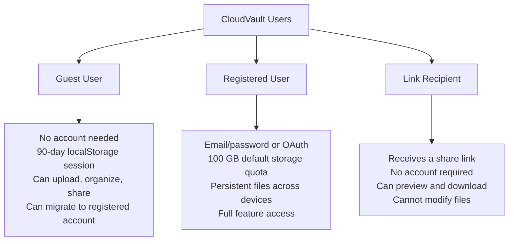
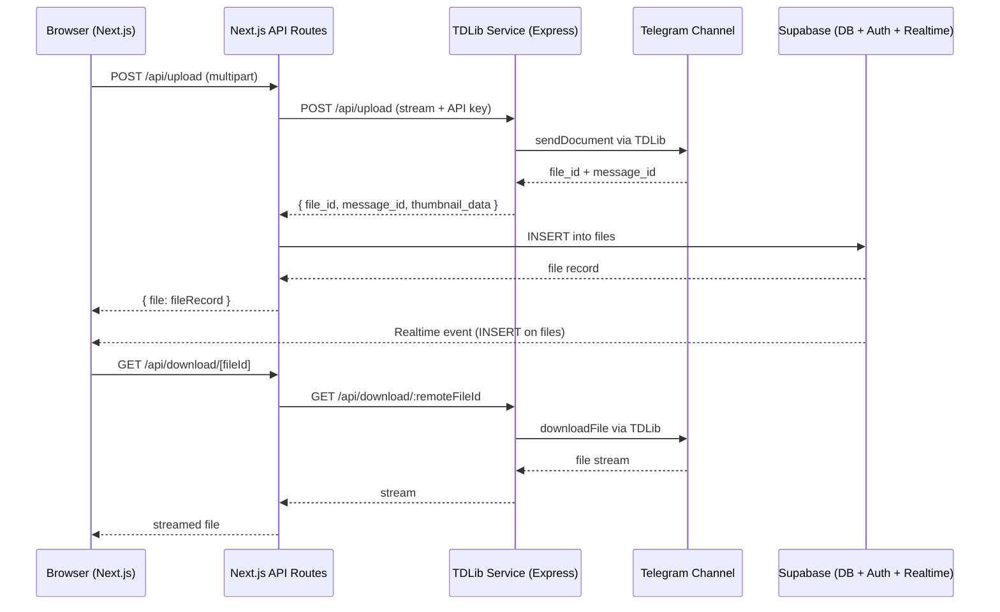
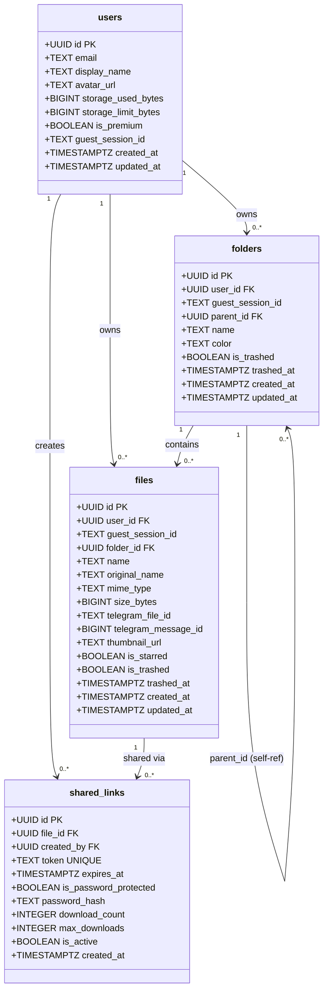
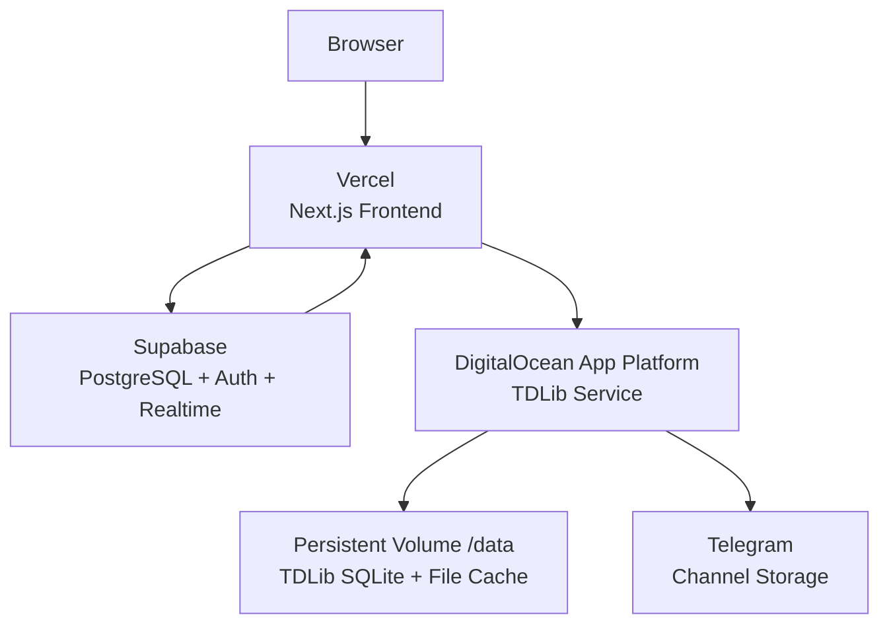

I have created the following plan after thorough exploration and analysis of the codebase. Follow the below plan verbatim. Trust the files and references. Do not re-verify what's written in the plan. Explore only when absolutely necessary. First implement all the proposed file changes and then I'll review all the changes together at the end.

## Observations

CloudVault is a full-stack cloud storage application that uses **Telegram as the actual file storage backend** (via TDLib), **Supabase** for metadata, authentication, and realtime updates, and a **Next.js 16** frontend. The monorepo contains two services: `frontain/` (Next.js + shadcn/ui + Zustand) and `tdlib-service/` (Express + TDLib). The existing `file:PRD.md` is empty — this plan describes exactly what to write in it.

## Approach

The PRD will be written directly into `file:PRD.md` at the repo root. It is structured as a standard Product Requirements Document covering product overview, goals, user personas, feature requirements, architecture, data model, API contracts, non-functional requirements, and constraints — all derived strictly from the existing codebase.

---

## Implementation Instructions

Write the following content into `file:PRD.md`:

---

# CloudVault — Product Requirements Document

**Version:** 1.0  
**Status:** Living Document  
**Last Updated:** February 2026

---

## 1. Product Overview

CloudVault is a **personal cloud file storage platform** that leverages Telegram's infrastructure as a zero-cost, high-capacity file storage backend. Users upload files through a polished web interface; files are stored as messages in a private Telegram channel via the TDLib API. File metadata, user accounts, folder structure, and share links are persisted in Supabase (PostgreSQL). Real-time UI updates are delivered via Supabase Realtime.

### 1.1 Elevator Pitch

> "Google Drive-like UX, backed by Telegram's unlimited storage — no monthly storage fees."

### 1.2 Core Value Propositions

| Value | Description |
|---|---|
| **Unlimited storage** | Telegram imposes no practical storage limit on bots/channels |
| **No signup required** | Guest sessions allow immediate use without registration |
| **Familiar UX** | Grid/list views, folders, starring, trash — identical to Google Drive |
| **Secure sharing** | Token-based share links with optional expiry and download limits |
| **Real-time sync** | Supabase Realtime pushes file/folder changes instantly |

---

## 2. Goals & Non-Goals

### 2.1 Goals

- Provide a fully functional file manager (upload, download, organize, share, preview) accessible from any browser
- Support files up to **2 GB** per upload
- Allow unauthenticated (guest) use with a 90-day session lifetime
- Enable seamless migration from guest to authenticated account
- Deploy with zero infrastructure cost for storage (Telegram backend)

### 2.2 Non-Goals (v1.0)

- Mobile native apps (iOS / Android)
- Collaborative editing of documents
- Real-time multi-user folder sharing (only link-based sharing)
- Versioning / file history
- Offline mode / PWA sync

---

## 3. User Personas

---

## 4. Feature Requirements

### 4.1 Authentication & Sessions

| ID | Requirement | Priority |
|---|---|---|
| AUTH-1 | Email/password sign-up and login via Supabase Auth | P0 |
| AUTH-2 | OAuth login (providers configured in Supabase) | P1 |
| AUTH-3 | Guest session created automatically on first visit; stored in `localStorage`; expires after 90 days | P0 |
| AUTH-4 | Guest-to-registered migration: files and folders are re-associated to the new `user_id` | P1 |
| AUTH-5 | Middleware (`file:frontain/src/middleware.ts`) protects `/dashboard` routes; unauthenticated users are redirected to `/auth/login` | P0 |

### 4.2 File Upload

| ID | Requirement | Priority |
|---|---|---|
| UP-1 | Drag-and-drop upload zone (`file:frontain/src/components/upload/upload-zone.tsx`) | P0 |
| UP-2 | Multi-file upload with per-file progress tracking (`file:frontain/src/components/upload/upload-progress.tsx`) | P0 |
| UP-3 | Maximum file size: **2 GB** per file | P0 |
| UP-4 | Supported MIME types: images, videos, audio, documents, archives, text/code files (full list in `file:frontain/src/types/file.types.ts`) | P0 |
| UP-5 | Files are streamed to the TDLib service (`POST /api/upload`) which sends them to a Telegram channel | P0 |
| UP-6 | On success, a record is inserted into the `files` Supabase table with `telegram_file_id` and `telegram_message_id` | P0 |
| UP-7 | Thumbnail is generated by the TDLib service and stored as `thumbnail_url` on the file record | P1 |
| UP-8 | Upload can be initiated from the current folder context (files are associated with `folder_id`) | P0 |

### 4.3 File Download

| ID | Requirement | Priority |
|---|---|---|
| DL-1 | Authenticated users download via `GET /api/download/[...params]` which proxies the stream from the TDLib service | P0 |
| DL-2 | Share link recipients download via `GET /api/share/[token]` which resolves the token and proxies the file | P0 |
| DL-3 | Downloads are streamed (not buffered in memory) to support large files | P0 |

### 4.4 File Organization

| ID | Requirement | Priority |
|---|---|---|
| ORG-1 | Create folders with a name and color (`file:frontain/src/components/modals/new-folder-modal.tsx`) | P0 |
| ORG-2 | Nested folders (unlimited depth via `parent_id` self-reference) | P0 |
| ORG-3 | Rename files and folders (`file:frontain/src/components/modals/rename-modal.tsx`) | P0 |
| ORG-4 | Move files between folders | P1 |
| ORG-5 | Star / unstar files | P0 |
| ORG-6 | Soft-delete to trash; restore from trash; permanent delete | P0 |
| ORG-7 | Breadcrumb navigation for nested folders | P0 |
| ORG-8 | Sidebar folder tree (`file:frontain/src/components/sidebar/folder-tree.tsx`) | P0 |

### 4.5 File Preview

| ID | Requirement | Priority |
|---|---|---|
| PRV-1 | In-browser image preview (`file:frontain/src/components/preview/image-preview.tsx`) | P0 |
| PRV-2 | In-browser video preview (`file:frontain/src/components/preview/video-preview.tsx`) | P0 |
| PRV-3 | In-browser PDF preview (`file:frontain/src/components/preview/pdf-preview.tsx`) | P0 |
| PRV-4 | Preview modal accessible from file card and file row | P0 |
| PRV-5 | Dedicated preview page at `/preview/[id]` | P1 |

### 4.6 File Sharing

| ID | Requirement | Priority |
|---|---|---|
| SHR-1 | Generate a unique token-based share link for any file | P0 |
| SHR-2 | Share links are reusable (same token returned if an active link already exists) | P0 |
| SHR-3 | Optional expiry date on share links | P1 |
| SHR-4 | Optional password protection on share links | P1 |
| SHR-5 | Optional maximum download count | P1 |
| SHR-6 | Public share page at `/share/[token]` — no login required | P0 |
| SHR-7 | Share modal (`file:frontain/src/components/modals/share-modal.tsx`) with copy-to-clipboard | P0 |

### 4.7 Search

| ID | Requirement | Priority |
|---|---|---|
| SCH-1 | Real-time client-side search across file and folder names | P0 |
| SCH-2 | Search bar in top bar (`file:frontain/src/components/top-bar/search-bar.tsx`) | P0 |
| SCH-3 | Search results filter both files and folders simultaneously | P0 |

### 4.8 Dashboard Views

| ID | Requirement | Priority |
|---|---|---|
| DSH-1 | **My Drive** — root-level files and folders, tabbed Recent/Starred | P0 |
| DSH-2 | **Folder view** — contents of a specific folder at `/dashboard/folder/[id]` | P0 |
| DSH-3 | **Recent** — all files sorted by `updated_at` desc at `/dashboard/recent` | P0 |
| DSH-4 | **Starred** — all starred files at `/dashboard/starred` | P0 |
| DSH-5 | **Shared** — files with active share links at `/dashboard/shared` | P0 |
| DSH-6 | **Trash** — soft-deleted files and folders at `/dashboard/trash` | P0 |
| DSH-7 | **Settings** — user profile and preferences at `/dashboard/settings` | P1 |
| DSH-8 | Grid view and list view toggle (persisted in Zustand `ui-store`) | P0 |
| DSH-9 | Suggested files section (most recently accessed, up to 6 files) | P1 |

### 4.9 Storage Meter

| ID | Requirement | Priority |
|---|---|---|
| STR-1 | Visual storage usage bar in sidebar (`file:frontain/src/components/storage/storage-meter.tsx`) | P0 |
| STR-2 | Default quota: **100 GB** per registered user | P0 |
| STR-3 | `storage_used_bytes` is incremented via the `increment_storage` Supabase function on each upload | P0 |
| STR-4 | `is_premium` flag on user record reserved for future tier upgrades | P2 |

### 4.10 Real-time Updates

| ID | Requirement | Priority |
|---|---|---|
| RT-1 | Supabase Realtime subscription on `files` and `folders` tables (`file:frontain/src/lib/realtime/use-realtime-files.ts`) | P0 |
| RT-2 | New uploads appear in the dashboard without a page refresh | P0 |
| RT-3 | Folder creation/rename/delete reflected instantly | P0 |

### 4.11 Context Menus

| ID | Requirement | Priority |
|---|---|---|
| CTX-1 | Right-click context menu on file cards/rows (`file:frontain/src/components/context-menu/file-context-menu.tsx`) | P0 |
| CTX-2 | Right-click context menu on folder cards (`file:frontain/src/components/context-menu/folder-context-menu.tsx`) | P0 |
| CTX-3 | Context menu actions: Download, Rename, Star/Unstar, Share, Move to Trash | P0 |

---

## 5. System Architecture

### 5.1 Service Breakdown

| Service | Technology | Hosting | Responsibility |
|---|---|---|---|
| `frontain` | Next.js 16, React 19, TypeScript, Tailwind CSS, shadcn/ui, Zustand | Vercel | UI, API routes, auth, metadata CRUD |
| `tdlib-service` | Node.js, Express 4, TDLib (`tdl` + `prebuilt-tdlib`) | DigitalOcean App Platform | Telegram upload/download/delete/thumbnail |
| Supabase | PostgreSQL, GoTrue Auth, Realtime | Supabase Cloud | User data, file metadata, RLS, realtime |

### 5.2 Security Model

- **Frontend ↔ TDLib Service:** Shared secret `TDLIB_SERVICE_API_KEY` sent as `Authorization: Bearer <key>` header; validated in `file:tdlib-service/src/middleware/auth.ts`
- **Frontend ↔ Supabase:** Anon key for client-side; service role key for server-side API routes only (never exposed to browser)
- **Row-Level Security:** All four Supabase tables (`users`, `files`, `folders`, `shared_links`) have RLS enabled; users can only access their own rows

---

## 6. Data Model

---

## 7. API Contract

### 7.1 Next.js API Routes (Frontend)

| Method | Path | Auth | Description |
|---|---|---|---|
| `POST` | `/api/upload` | user_id or guest_session_id | Upload file; proxies to TDLib service |
| `GET` | `/api/files` | user_id or guest_session_id | List files for current user/session |
| `GET/POST/DELETE` | `/api/folders` | user_id or guest_session_id | CRUD for folders |
| `POST` | `/api/share` | user_id or guest_session_id | Create share link |
| `GET` | `/api/share/[token]` | None | Resolve share token → file metadata |
| `GET` | `/api/download/[...params]` | user_id or guest_session_id | Stream file download |

### 7.2 TDLib Service Routes

| Method | Path | Auth | Description |
|---|---|---|---|
| `GET` | `/health` | None | Health check; returns `tdlib_ready` status |
| `POST` | `/api/upload` | API key | Upload file to Telegram channel |
| `GET` | `/api/download/:remoteFileId` | API key | Stream file from Telegram |
| `GET` | `/api/download/status/:remoteFileId` | API key | Download progress status |
| `GET` | `/api/thumbnail/:remoteFileId` | API key | Get thumbnail for media file |
| `POST` | `/api/thumbnail/from-message` | API key | Get thumbnail by message ID |
| `DELETE` | `/api/message/:chatId/:messageId` | API key | Delete Telegram message (file) |
| `POST` | `/api/message/cleanup` | API key | Bulk cleanup of messages |

---

## 8. Environment Variables

### 8.1 `tdlib-service` (DigitalOcean)

| Variable | Description |
|---|---|
| `TELEGRAM_BOT_TOKEN` | Bot token from @BotFather |
| `TELEGRAM_API_ID` | API ID from my.telegram.org |
| `TELEGRAM_API_HASH` | API hash from my.telegram.org |
| `TELEGRAM_CHANNEL_ID` | Target channel ID (e.g. `-100xxxxxxxxxx`) |
| `TDLIB_SERVICE_API_KEY` | Shared secret for frontend ↔ backend auth |
| `PORT` | HTTP port (default `3001`) |
| `TDLIB_DATABASE_PATH` | Persistent volume path for TDLib SQLite DB |
| `TDLIB_FILES_PATH` | Persistent volume path for TDLib file cache |

### 8.2 `frontain` (Vercel)

| Variable | Description |
|---|---|
| `NEXT_PUBLIC_SUPABASE_URL` | Supabase project URL |
| `NEXT_PUBLIC_SUPABASE_ANON_KEY` | Supabase anon key (safe for browser) |
| `SUPABASE_SERVICE_ROLE_KEY` | Supabase service role key (server-only) |
| `TDLIB_SERVICE_URL` | URL of the deployed TDLib service |
| `TDLIB_SERVICE_API_KEY` | Must match the backend's value |

---

## 9. Non-Functional Requirements

| Category | Requirement |
|---|---|
| **Performance** | File uploads stream directly without full buffering; Next.js route `maxDuration` set to 300s for large files |
| **Scalability** | TDLib service is stateful (SQLite session); horizontal scaling requires session sharing — single instance recommended for v1 |
| **Reliability** | TDLib requires a persistent volume (`/data`) to survive container restarts without re-authentication |
| **Security** | All secrets encrypted at rest on hosting platforms; RLS enforced on all DB tables; service role key never sent to browser |
| **Availability** | TDLib service health endpoint (`/health`) exposes `tdlib_ready` for uptime monitoring |
| **File Size Limit** | 2 GB per file (enforced in both frontend validation and API route) |
| **Storage Quota** | 100 GB default per registered user; tracked via `storage_used_bytes` |
| **Session Expiry** | Guest sessions expire after 90 days; stored in `localStorage` |
| **Realtime Latency** | File/folder changes reflected in UI within ~1 second via Supabase Realtime |

---

## 10. Deployment Topology

See `file:DEPLOYMENT.md` for the full step-by-step deployment guide.

---

## 11. File Type Support Matrix

| Category | MIME Types |
|---|---|
| Images | JPEG, PNG, GIF, WebP, SVG, BMP, TIFF, ICO, AVIF |
| Videos | MP4, WebM, QuickTime, AVI, MKV, MPEG |
| Audio | MP3, WAV, OGG, WebM, AAC, M4A, FLAC |
| Documents | PDF, DOCX, XLSX, PPTX, RTF, ODT, ODS, ODP |
| Archives | ZIP, RAR, 7Z, GZIP, TAR, BZIP2 |
| Text / Code | TXT, MD, CSV, HTML, CSS, JS, TS, JSON, XML, SQL, Python, Java, C/C++, C#, PHP, Ruby, Go, Rust, Swift, Kotlin, YAML |
| Binary | `application/octet-stream` (catch-all) |

---

## 12. Key Source Files Reference

| Area | File |
|---|---|
| DB schema | `file:frontain/supabase/schema.sql` |
| TypeScript DB types | `file:frontain/src/types/database.types.ts` |
| File utility types | `file:frontain/src/types/file.types.ts` |
| Auth provider | `file:frontain/src/app/providers/auth-provider.tsx` |
| Guest session logic | `file:frontain/src/lib/guest-session.ts` |
| Supabase client (browser) | `file:frontain/src/lib/supabase/client.ts` |
| Supabase client (server) | `file:frontain/src/lib/supabase/server.ts` |
| Telegram upload lib | `file:frontain/src/lib/telegram/upload.ts` |
| Telegram download lib | `file:frontain/src/lib/telegram/download.ts` |
| Realtime hook | `file:frontain/src/lib/realtime/use-realtime-files.ts` |
| Files Zustand store | `file:frontain/src/store/files-store.ts` |
| UI Zustand store | `file:frontain/src/store/ui-store.ts` |
| TDLib service entry | `file:tdlib-service/src/index.ts` |
| TDLib client wrapper | `file:tdlib-service/src/tdlib-client.ts` |
| API key middleware | `file:tdlib-service/src/middleware/auth.ts` |
| Deployment guide | `file:DEPLOYMENT.md` |